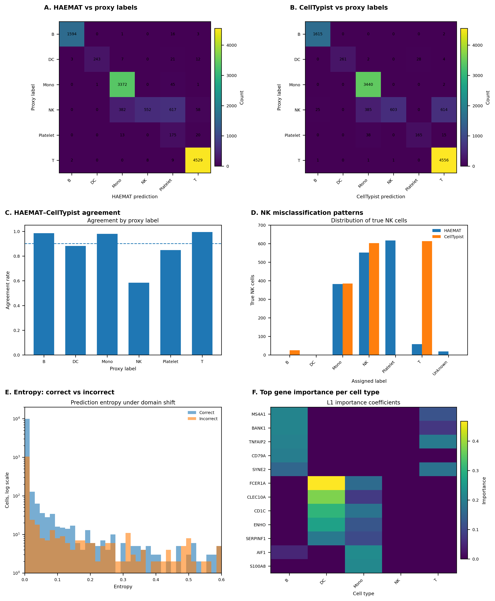
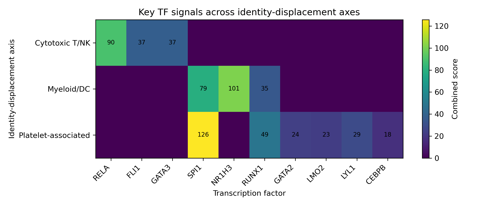

# HAEMAT: Cross-dataset immune cell classification and identity displacement analysis
_A framework for uncertainty-aware modelling of immune cell identity structure in single-cell transcriptomics_

This repository implements an interpretable machine learning and regulatory analysis framework for immune cell identity analysis in single-cell RNA-seq (scRNA-seq) data.

The project began as a cross-dataset PBMC classification framework and developed into a broader investigation of transcriptional ambiguity, transitional immune states, and structured identity displacement across immune populations. The workflow integrates probabilistic classification, transcriptional program analysis, regulatory enrichment, and chromatin accessibility overlap analysis to characterise how immune cell identities shift across related cellular states.

HAEMAT treats prediction uncertainty as biologically meaningful structure that may reflect overlapping lineage programs, intermediate immune states, or unstable transcriptional configurations. In this framework, ambiguous predictions are analysed as potential indicators of dynamic immune identity organisation, including cytotoxic, myeloid, dendritic, and platelet-associated transcriptional programs that partially overlap across cells and datasets.

---

# Overview

The workflow combines:

- interpretable machine learning
- uncertainty-aware prediction analysis
- hierarchical lineage modelling
- transcriptional program scoring
- identity displacement analysis
- exploratory regulatory analysis
- TF enrichment and network analysis
- chromatin accessibility integration using ENCODE ATAC-seq datasets

The framework analyses how immune cell identities shift, overlap, and transition across datasets and transcriptional states.

---

# Data

Training dataset:

- PBMC 5k (10x Genomics)

External validation dataset:

- PBMC 10k (10x Genomics)

Proxy labels from PBMC10k are used for evaluation, but are not assumed to represent perfect biological ground truth.

---

# Methods

The pipeline includes:

- Logistic regression classifier (L1-regularised)
- k-nearest neighbours
- random forest classifier
- hierarchical lineage-aware classification
- entropy-based uncertainty analysis
- top-2 probability gap analysis
- post hoc decision layer
- benchmark comparison with CellTypist
- marker-informed feature space
- transcriptional program scoring
- identity displacement modelling
- TF enrichment analysis
- TF-axis network construction
- promoter-level ATAC accessibility overlap analysis

---

# Summary figure



---

# Transitional identity framework

A major focus of HAEMAT is the analysis of ambiguous and transitional immune cell states.

The workflow identifies cells with unstable transcriptional identity profiles using:

- prediction entropy
- probability structure
- lineage-aware ambiguity
- program-level transcriptional scoring

This allows the construction of structured transitional identity landscapes rather than binary correct/incorrect classifications.

---

# Identity displacement analysis

The framework models identity displacement between dominant and secondary predicted identities.

High-displacement cells were found to cluster into several major transcriptional axes:

| Axis | Representative genes |
|---|---|
| Cytotoxic T / NK | NKG7, GNLY, PRF1, GZMB, CCL5 |
| Myeloid / dendritic | LYZ, TYROBP, FCER1A, CLEC10A, IRF8 |
| Platelet-associated immune | PF4, PPBP, GP9, S100A8, S100A9 |

These states are interpreted as structured immune identity programs rather than isolated misclassification events.

---

# Regulatory integration

The repository includes exploratory regulatory analyses integrating ENCODE chromatin accessibility datasets.

Analyses include:

- promoter interval generation
- overlap with immune ATAC-seq peak datasets
- TF enrichment analysis
- TF-axis regulatory network construction

Accessible chromatin overlaps support the biological coherence of several identity-displacement axes.

Examples include:

- cytotoxic axis overlap with NK and CD8 T ATAC profiles
- dendritic accessibility enrichment in the myeloid/DC axis
- platelet-associated accessibility patterns partially overlapping immune regulatory states

---

# TF-axis regulatory heatmap


---

# Key observations

The analyses suggest that:

- immune classification uncertainty is highly structured
- ambiguity concentrates along biologically meaningful transcriptional axes
- NK-associated ambiguity represents a major recurrent instability pattern
- platelet-associated transcriptional programs partially overlap immune regulatory states
- uncertainty metrics capture biologically informative transitional states
- regulatory programs partially support identity-displacement structure

---

# Interpretation

HAEMAT frames classification disagreement and prediction uncertainty as interpretable biological structure rather than purely technical failure.

The framework suggests that transitional immune identities can be represented as:

- probabilistic transcriptional states
- lineage-displacement trajectories
- partially overlapping regulatory programs

This creates a bridge between interpretable machine learning and immune cell state biology.

---

# Repository structure

```text
workflow/
    Snakefile

scripts/
    run_pipeline.py
    cross_dataset.py
    decision_layer.py
    hierarchical_models.py
    program_scoring.py
    transitional_state_detection.py
    compute_identity_displacement.py
    summarize_displacement_axes.py
    axis_program_analysis.py
    tf_enrichment_axes.py
    plot_tf_axis_heatmap.py

config/
data/
results/
```

---

# Main outputs

The workflow generates:

- confusion matrices
- calibration curves
- uncertainty summaries
- transitional state plots
- displacement matrices
- program heatmaps
- TF-axis heatmaps
- TF regulatory network figures
- chromatin accessibility overlap summaries

---

# Technologies

- Python
- Scanpy
- scikit-learn
- pandas
- matplotlib
- seaborn
- Snakemake
- bedtools
- ENCODE datasets

---

# Scope and future direction

This repository focuses on uncertainty-aware modelling of immune cell identity structure in PBMC datasets.

Future directions include:

- integration with disease-associated PBMC cohorts
- matched multiome analysis
- trajectory-aware modelling
- perturbation-aware immune state analysis
- regulatory state inference
- patient-level immune state profiling

The long-term goal is to develop interpretable frameworks that model immune identity as a probabilistic and dynamic transcriptional landscape rather than a fixed categorical label.
