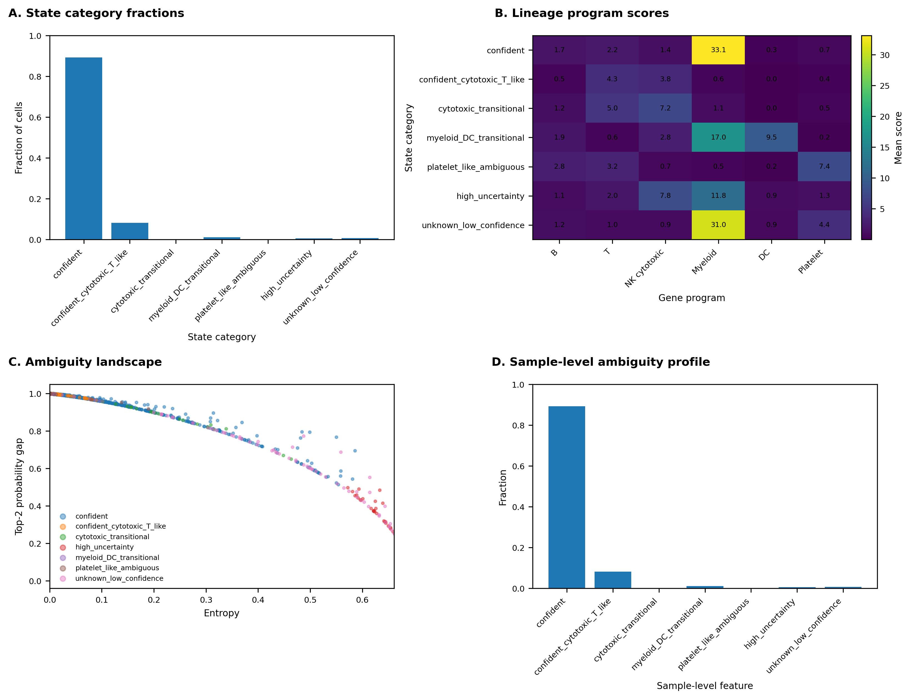

# HAEMAT: Cross-dataset immune cell classification and identity displacement analysis

_A framework for uncertainty-aware and artifact-aware modelling of immune cell identity structure in single-cell transcriptomics_

HAEMAT is an interpretable machine learning and regulatory analysis framework for immune cell identity analysis in single-cell RNA-seq (scRNA-seq) data.

The project began as a cross-dataset PBMC classification framework and developed into a broader investigation of transcriptional ambiguity, transitional immune states, and structured identity displacement across immune populations. The workflow integrates probabilistic classification, transcriptional program analysis, regulatory enrichment, chromatin accessibility overlap analysis, and artifact-aware uncertainty interpretation to characterise how immune cell identities shift across related transcriptional states.

A central concept in HAEMAT is that prediction uncertainty may contain biologically meaningful structure. However, the framework also explicitly distinguishes biologically interpretable ambiguity from uncertainty likely arising from technical artefacts such as platelet-associated ambient RNA contamination, low-quality cells, or doublet-like transcriptional mixtures.

The framework therefore models immune identity as a probabilistic and dynamic transcriptional landscape while incorporating quality-aware interpretation layers.

---

# Overview

The workflow combines:

- interpretable machine learning
- uncertainty-aware prediction analysis
- hierarchical lineage modelling
- transcriptional program scoring
- identity displacement analysis
- transitional-state detection
- artifact-aware ambiguity interpretation
- TF enrichment and regulatory analysis
- chromatin accessibility integration using ENCODE ATAC-seq datasets

The framework analyses how immune cell identities shift, overlap, destabilise, and transition across datasets and transcriptional states.

---

# Data

Training dataset:

- PBMC 5k (10x Genomics)

External validation dataset:

- PBMC 10k (10x Genomics)

Proxy labels derived from PBMC10k are used for evaluation but are not assumed to represent perfect biological ground truth.

---

# Methods

The pipeline includes:

- Logistic regression classifier (L1-regularised)
- k-nearest neighbours
- random forest classifier
- hierarchical lineage-aware classification
- entropy-based uncertainty analysis
- top-2 probability gap analysis
- post hoc decision layer
- benchmark comparison with CellTypist
- marker-informed feature space
- transcriptional program scoring
- identity displacement modelling
- transitional-state classification
- TF enrichment analysis
- TF-axis network construction
- promoter-level ATAC accessibility overlap analysis
- artifact-aware ambiguity filtering

---

# Summary figure


The summary analysis shows that HAEMAT performs competitively against CellTypist while exposing structured uncertainty patterns that are not visible in conventional classification metrics alone.

The framework particularly highlights:

- recurrent NK/T ambiguity structure
- transitional myeloid/DC states
- entropy-associated prediction instability
- marker-driven lineage separation
- structured misclassification topology under cross-dataset transfer

---

# Transitional-state framework

A major focus of HAEMAT is the analysis of ambiguous and transitional immune cell states.

The workflow identifies cells with unstable transcriptional identity profiles using:

- prediction entropy
- probability structure
- lineage-aware ambiguity
- displacement analysis
- transcriptional program scoring

Rather than treating all uncertainty as classifier failure, the framework analyses whether uncertainty forms biologically coherent structures.

This enables the construction of structured transitional-state landscapes rather than binary correct/incorrect prediction systems.

---

# Transitional-state summary



Most cells remain transcriptionally stable and confidently classified. However, a smaller subset forms coherent ambiguity structures enriched along specific lineage relationships.

The strongest clean ambiguity axis observed in the current PBMC analysis is the cytotoxic T/NK transition space, while a secondary ambiguity structure is observed between myeloid and dendritic programs.

Platelet-associated ambiguity behaves differently and is interpreted more cautiously due to its known relationship with ambient RNA contamination and platelet-derived transcriptional carryover in PBMC single-cell datasets.

---

# Artifact-aware ambiguity interpretation

To distinguish biologically interpretable ambiguity from technical artefacts, HAEMAT implements an artifact-aware interpretation layer.

The framework evaluates:

- platelet-associated transcriptional contamination
- low-quality uncertainty structure
- doublet-like mixed transcriptional states
- stable lineage-associated ambiguity

This separates uncertainty likely arising from technical effects from cleaner transitional immune-state configurations.

Current PBMC10k results show:

| Category | Fraction |
|---|---|
| Stable/non-uncertain cells | ~94.9% |
| Clean biological ambiguity candidates | ~2.7% |
| Platelet-associated artifact-sensitive ambiguity | ~1.9% |
| Low-quality uncertain cells | ~0.4% |
| Possible doublets | <0.1% |

After artifact-aware filtering, the dominant biologically coherent ambiguity axis remains the NK/T cytotoxic transition structure.

---

# Identity displacement analysis

The framework models identity displacement between dominant and secondary predicted identities.

High-displacement cells cluster into several recurrent transcriptional axes:

| Axis | Representative genes |
|---|---|
| Cytotoxic T / NK | NKG7, GNLY, PRF1, GZMB, CCL5 |
| Myeloid / dendritic | LYZ, TYROBP, FCER1A, CLEC10A, IRF8 |
| Platelet-associated ambiguity | PF4, PPBP, GP9, S100A8, S100A9 |

The cytotoxic T/NK axis represents the dominant clean ambiguity structure after artifact-aware filtering.

The myeloid/DC axis shows partially coherent antigen-presentation and inflammatory transcriptional programs.

Platelet-associated displacement patterns are retained as contamination-sensitive structures rather than interpreted as primary immune lineage transitions.

---

# Regulatory integration

The repository includes exploratory regulatory analyses integrating ENCODE chromatin accessibility datasets.

Analyses include:

- promoter interval generation
- overlap with immune ATAC-seq peak datasets
- TF enrichment analysis
- TF-axis regulatory network construction

Accessible chromatin overlaps support the biological coherence of several identity-displacement axes.

Examples include:

- cytotoxic-axis overlap with NK and CD8 T accessibility profiles
- dendritic accessibility enrichment within the myeloid/DC axis
- partial regulatory coherence across transitional transcriptional programs

---

# TF-axis regulatory heatmap


Distinct identity-displacement axes show partially coherent transcription factor structures.

Examples include:

- RELA-associated inflammatory signalling within cytotoxic transitions
- SPI1 enrichment in myeloid/DC displacement structure
- RUNX1 and GATA-family contributions to lineage-associated regulatory programs

These analyses suggest that at least part of the observed ambiguity structure reflects coordinated regulatory organisation rather than purely stochastic classifier instability.

---

# Key observations

The analyses suggest that:

- immune classification uncertainty is highly structured
- most cells remain transcriptionally stable under cross-dataset transfer
- biologically coherent ambiguity concentrates along NK/T and myeloid/DC axes
- platelet-associated ambiguity behaves differently from cleaner lineage transitions
- entropy and probability-gap metrics capture meaningful transitional-state structure
- regulatory programs partially support identity-displacement organisation
- artifact-aware filtering improves separation between biological and technical uncertainty

---

# Interpretation

HAEMAT frames classification disagreement and prediction uncertainty as interpretable transcriptional structure rather than purely technical prediction failure.

At the same time, the framework avoids assuming that all ambiguity is biologically meaningful.

Instead, HAEMAT separates uncertainty into:

- stable lineage-associated ambiguity
- transitional transcriptional states
- contamination-sensitive ambiguity
- low-quality uncertainty
- doublet-like mixed transcriptional structure

This creates a bridge between interpretable machine learning, uncertainty modelling, and immune-state biology.

---

# Repository structure

```text
workflow/
    Snakefile

scripts/
    run_pipeline.py
    cross_dataset.py
    decision_layer.py
    hierarchical_models.py
    program_scoring.py
    transitional_state_detection.py
    compute_identity_displacement.py
    summarize_displacement_axes.py
    axis_program_analysis.py
    tf_enrichment_axes.py
    artifact_detection.py
    plot_tf_axis_heatmap.py

config/
data/
results/
figures/
```

---

# Main outputs

The workflow generates:

- confusion matrices
- uncertainty summaries
- entropy distributions
- transitional-state plots
- displacement matrices
- displacement-axis summaries
- program heatmaps
- TF-axis heatmaps
- TF regulatory network figures
- chromatin accessibility overlap summaries
- artifact-aware ambiguity summaries

---

# Technologies

- Python
- Scanpy
- scikit-learn
- pandas
- matplotlib
- seaborn
- Snakemake
- bedtools
- ENCODE datasets

---

# Scope and future direction

This repository currently focuses on uncertainty-aware and artifact-aware modelling of immune identity structure in PBMC datasets.

Future directions include:

- disease-associated PBMC cohorts
- matched multiome analysis
- trajectory-aware modelling
- perturbation-aware immune-state analysis
- regulatory-state inference
- patient-level immune-state profiling
- integration with doublet-detection frameworks
- probabilistic lineage-state modelling

The long-term goal is to develop interpretable frameworks that model immune identity as a probabilistic, transitional, and dynamically regulated transcriptional landscape.

